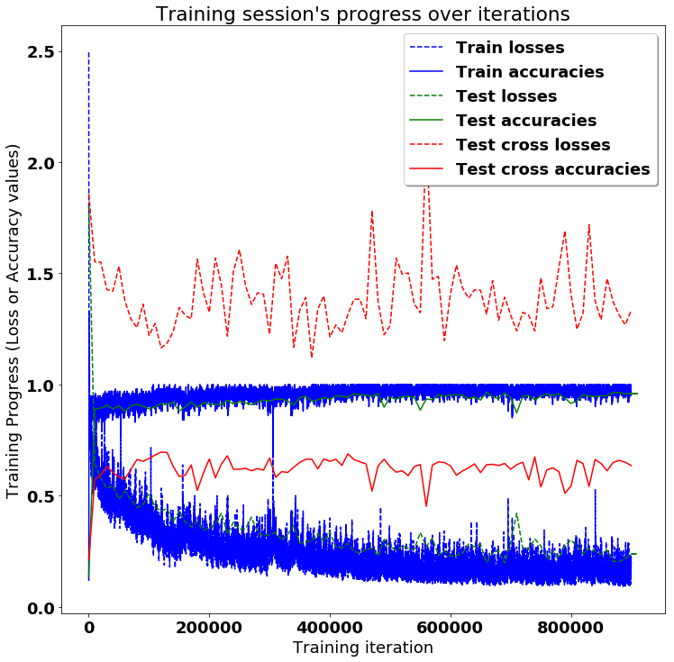

# LSTMs for Human Activity Recognition

Human activity recognition using smartwatch dataset and an LSTM RNN. Classifying the type of movement amongst six categories:
- WALKING,
- SITTING,
- STANDING,
- LAYING.

Compared to a classical approach, using a Recurrent Neural Networks (RNN) with Long Short-Term Memory cells (LSTMs) require no or almost no feature engineering. Data can be fed directly into the neural network who acts like a black box, modeling the problem correctly. Other research on the activity recognition dataset used mostly use a big amount of feature engineering, which is rather a signal processing approach combined with classical data science techniques. The approach here is rather very simple in terms of how much did the data was preprocessed. 

## Details about input data

I will be using an LSTM on the data to learn (as a smartwatch attached on the wrist) to recognise the type of activity that the user is doing. A similar dataset's description based on prior research goes like this:

> The sensor signals (accelerometer and gyroscope) were pre-processed by applying noise filters and then sampled in fixed-width sliding windows of 2.56 sec and 50% overlap (128 readings/window). The sensor acceleration signal, which has gravitational and body motion components, was separated using a Butterworth low-pass filter into body acceleration and gravity. The gravitational force is assumed to have only low frequency components, therefore a filter with 0.3 Hz cutoff frequency was used. 

That said, I will use the almost raw data. 

## What is an RNN?

As explained in [this article](http://karpathy.github.io/2015/05/21/rnn-effectiveness/), an RNN takes many input vectors to process them and output other vectors. It can be roughly pictured like in the image below, imagining each rectangle has a vectorial depth and other special hidden quirks in the image below. **In our case, the "many to one" architecture is used**: we accept time series of feature vectors (one vector per time step) to convert them to a probability vector at the output for classification. Note that a "one to one" architecture would be a standard feedforward neural network. 


An LSTM is an improved RNN. It is more complex, but easier to train, avoiding what is called the vanishing gradient problem. 


## Results 

Scroll on! Nice visuals awaits. 


```python
# All Includes

import numpy as np
import matplotlib
import matplotlib.pyplot as plt
import tensorflow as tf  # Version 1.0.0 (some previous versions are used in past commits)
from sklearn import metrics

import os
```

    /usr/local/lib/python2.7/dist-packages/h5py/__init__.py:36: FutureWarning: Conversion of the second argument of issubdtype from `float` to `np.floating` is deprecated. In future, it will be treated as `np.float64 == np.dtype(float).type`.
      from ._conv import register_converters as _register_converters


```python
# Useful Constants

# Those are separate normalised input features for the neural network
INPUT_SIGNAL_TYPES = [
    "body_acc_x_",
    "body_acc_y_",
    "body_acc_z_",
    "some_label"
]

# Output classes to learn how to classify
LABELS = [
    "LAYING_DOWN",
    "SITTING",
    "STANDING",
    "WALKING"
    
] 

```

## Let's start by downloading the data: 


```python
import pandas as pd

input_file = "merged_jay.csv"

# comma delimited is the default
df = pd.read_csv(input_file, header = None, names = ["Timestamp","X","Y","Z","P","Label"])
```


```python
df["Label"] = df["Label"].astype('category')
```


```python
df.dtypes
```


    Timestamp       int64
    X             float64
    Y             float64
    Z             float64
    P               int64
    Label        category
    dtype: object


```python
df["Label"].value_counts()
```


    laying_down    1232100
    sitting         384286
    walking         226655
    standing        186664
    Name: Label, dtype: int64


```python
df["Label"] = df["Label"].cat.codes
df["Label"].value_counts()
```


    0    1232100
    1     384286
    3     226655
    2     186664
    Name: Label, dtype: int64


```python
df.describe()
```


<div>
<style scoped>
    .dataframe tbody tr th:only-of-type {
        vertical-align: middle;
    }

    .dataframe tbody tr th {
        vertical-align: top;
    }

    .dataframe thead th {
        text-align: right;
    }
</style>
<table border="1" class="dataframe">
  <thead>
    <tr style="text-align: right;">
      <th></th>
      <th>Timestamp</th>
      <th>X</th>
      <th>Y</th>
      <th>Z</th>
      <th>P</th>
      <th>Label</th>
    </tr>
  </thead>
  <tbody>
    <tr>
      <th>count</th>
      <td>2.029705e+06</td>
      <td>2.029705e+06</td>
      <td>2.029705e+06</td>
      <td>2.029705e+06</td>
      <td>2.029705e+06</td>
      <td>2.029705e+06</td>
    </tr>
    <tr>
      <th>mean</th>
      <td>1.519213e+12</td>
      <td>2.196267e+00</td>
      <td>5.010439e-01</td>
      <td>4.797433e+00</td>
      <td>2.859706e+00</td>
      <td>7.082699e-01</td>
    </tr>
    <tr>
      <th>std</th>
      <td>1.270435e+08</td>
      <td>5.581570e+00</td>
      <td>5.467828e+00</td>
      <td>2.523419e+00</td>
      <td>3.472917e-01</td>
      <td>1.029840e+00</td>
    </tr>
    <tr>
      <th>min</th>
      <td>1.519084e+12</td>
      <td>-1.960391e+01</td>
      <td>-1.960391e+01</td>
      <td>-1.960391e+01</td>
      <td>2.000000e+00</td>
      <td>0.000000e+00</td>
    </tr>
    <tr>
      <th>25%</th>
      <td>1.519087e+12</td>
      <td>-2.159063e+00</td>
      <td>-5.108028e+00</td>
      <td>3.719717e+00</td>
      <td>3.000000e+00</td>
      <td>0.000000e+00</td>
    </tr>
    <tr>
      <th>50%</th>
      <td>1.519220e+12</td>
      <td>4.409085e+00</td>
      <td>2.676090e+00</td>
      <td>4.772918e+00</td>
      <td>3.000000e+00</td>
      <td>0.000000e+00</td>
    </tr>
    <tr>
      <th>75%</th>
      <td>1.519284e+12</td>
      <td>6.975067e+00</td>
      <td>5.242072e+00</td>
      <td>6.659107e+00</td>
      <td>3.000000e+00</td>
      <td>1.000000e+00</td>
    </tr>
    <tr>
      <th>max</th>
      <td>1.519759e+12</td>
      <td>1.959434e+01</td>
      <td>1.568648e+02</td>
      <td>1.959434e+01</td>
      <td>3.000000e+00</td>
      <td>3.000000e+00</td>
    </tr>
  </tbody>
</table>
</div>


```python
# create a numpy array with the numeric values for input into scikit-learn
numpy_array = df.as_matrix()
```


```python
numpy_array.shape
```


    (2029705, 6)


```python
import random
from scipy import stats
X = []
Y = []
random.seed(1337)
data_size = 10000
while(len(X)<data_size):
    l = random.randint(0, numpy_array.shape[0]-512)
    X_values = numpy_array[l:l+512,1:5]
    Y_values = numpy_array[l:l+512,5]
    if (stats.describe(Y_values)[1][0] == stats.describe(Y_values)[1][1])and (stats.describe(Y_values)[1][0]!=-1): #if min and max are same
        X.append(X_values)
        Y.append(stats.describe(Y_values)[1][0])
```


```python
X = np.asarray(X)
Y = np.asarray(Y)
print(X.shape)
print(Y.shape)
```

    (10000, 512, 4)
    (10000,)


## Preparing dataset:


```python
split = int(.9*data_size)
X_train = X[0:split,]
y_train = Y[0:split,]
X_test = X[split:data_size,]
y_test = Y[split:data_size,]
```


```python
print(X_train.shape)
print(y_train.shape)
print(set(y_train))
print(X_test.shape)
print(y_test.shape)
print(set(y_test))
```

    (9000, 512, 4)
    (9000,)
    set([0.0, 1.0, 2.0, 3.0])
    (1000, 512, 4)
    (1000,)
    set([0.0, 1.0, 2.0, 3.0])


# Testing on Cross subject dataset


```python
input_file = "merged_shr.csv"

# comma delimited is the default
df = pd.read_csv(input_file, header = 0, names = ["Timestamp","X","Y","Z","P","Label"])
df["Label"] = df["Label"].astype('category')

```


```python
df["Label"].value_counts()
```


    laying_down    1134246
    sitting        1015813
    walking         673939
    standing        641209
    Name: Label, dtype: int64


```python
df["Label"] = df["Label"].cat.codes
df["Label"].value_counts()
```


     0    1134246
     1    1015813
     3     673939
     2     641209
    -1      28747
    Name: Label, dtype: int64


```python
numpy_array = df.as_matrix()
X_c = []
Y_c = []
random.seed(101)
data_size = 10000
while(len(X_c)<data_size):
    l = random.randint(0, numpy_array.shape[0]-512)
    X_values = numpy_array[l:l+512,1:5]
    Y_values = numpy_array[l:l+512,5]
    if (stats.describe(Y_values)[1][0] == stats.describe(Y_values)[1][1]) and (stats.describe(Y_values)[1][0]!=-1): #if min and max are same
        X_c.append(X_values)
        Y_c.append(stats.describe(Y_values)[1][0])
X_c = np.asarray(X_c)
Y_c = np.asarray(Y_c)
```


```python
print(X_c.shape)
print(Y_c.shape)
print(set(Y_c))
```

    (10000, 512, 4)
    (10000,)
    set([0.0, 1.0, 2.0, 3.0])


## Additionnal Parameters:

Here are some core parameter definitions for the training. 

The whole neural network's structure could be summarised by enumerating those parameters and the fact an LSTM is used. 


```python
# Input Data 

training_data_count = len(X_train)  # 9000 training series (with 50% overlap between each serie)
test_data_count = len(X_test)  # 1000 testing series
n_steps = len(X_train[0])  # 512 timesteps per series
n_input = len(X_train[0][0])  # 4 input parameters per timestep


# LSTM Neural Network's internal structure

n_hidden = 32 # Hidden layer num of features
n_classes = 4 # Total classes (should go up, or should go down)


# Training 

learning_rate = 0.0025
dropout = 0.8
lambda_loss_amount = 0.0015
training_iters = training_data_count * 100  # Loop 10 times on the dataset
batch_size = 100
display_iter = 10000  # To show test set accuracy during training


# Some debugging info

print("Some useful info to get an insight on dataset's shape and normalisation:")
print("(X shape, y shape, every X's mean, every X's standard deviation)")
print(X_test.shape, y_test.shape, np.mean(X_test), np.std(X_test))
print("The dataset is therefore properly normalised, as expected, but not yet one-hot encoded.")

```

    Some useful info to get an insight on dataset's shape and normalisation:
    (X shape, y shape, every X's mean, every X's standard deviation)
    ((1000, 512, 4), (1000,), 2.5607604715790657, 4.409608106139619)
    The dataset is therefore properly normalised, as expected, but not yet one-hot encoded.


```python
stats.describe(y_test)
```


    DescribeResult(nobs=1000, minmax=(0.0, 3.0), mean=0.75, variance=1.1206206206206206, skewness=1.1238891379506741, kurtosis=-0.17419048931793135)


## Utility functions for training:


```python
def LSTM_RNN(_X, _weights, _biases, _keep_prob):
    # Function returns a tensorflow LSTM (RNN) artificial neural network from given parameters. 
    # Moreover, two LSTM cells are stacked which adds deepness to the neural network. 
    # Note, some code of this notebook is inspired from an slightly different 
    # RNN architecture used on another dataset, some of the credits goes to 
    # "aymericdamien" under the MIT license.

    # (NOTE: This step could be greatly optimised by shaping the dataset once
    # input shape: (batch_size, n_steps, n_input)
    _X = tf.transpose(_X, [1, 0, 2])  # permute n_steps and batch_size
    # Reshape to prepare input to hidden activation
    _X = tf.reshape(_X, [-1, n_input]) 
    # new shape: (n_steps*batch_size, n_input)
    
    # Linear activation
    _X = tf.matmul(_X, _weights['hidden']) + _biases['hidden']
    # Dropout
    _X = tf.nn.dropout(_X, _keep_prob)
    #RELU
    _X = tf.nn.relu(_X)
    # Split data because rnn cell needs a list of inputs for the RNN inner loop
    _X = tf.split(_X, n_steps, 0) 
    # new shape: n_steps * (batch_size, n_hidden)

    # Define two stacked LSTM cells (two recurrent layers deep) with tensorflow
    lstm_cell_1 = tf.contrib.rnn.BasicLSTMCell(n_hidden, forget_bias=1.0, state_is_tuple=True)
    lstm_cell_2 = tf.contrib.rnn.BasicLSTMCell(n_hidden, forget_bias=1.0, state_is_tuple=True)
    lstm_cells = tf.contrib.rnn.MultiRNNCell([lstm_cell_1, lstm_cell_2], state_is_tuple=True)
    # Get LSTM cell output
    outputs, states = tf.contrib.rnn.static_rnn(lstm_cells, _X, dtype=tf.float32)

    # Get last time step's output feature for a "many to one" style classifier, 
    # as in the image describing RNNs at the top of this page
    lstm_last_output = outputs[-1]
    
    # Linear activation
    return tf.matmul(lstm_last_output, _weights['out']) + _biases['out']


def extract_batch_size(_train, step, batch_size):
    # Function to fetch a "batch_size" amount of data from "(X|y)_train" data. 
    
    shape = list(_train.shape)
    shape[0] = batch_size
    batch_s = np.empty(shape)

    for i in range(batch_size):
        # Loop index
        index = ((step-1)*batch_size + i) % len(_train)
        batch_s[i] = _train[index] 

    return batch_s


def one_hot(y_):
    # Function to encode output labels from number indexes 
    # e.g.: [[5], [0], [3]] --> [[0, 0, 0, 0, 0, 1], [1, 0, 0, 0, 0, 0], [0, 0, 0, 1, 0, 0]]
    
    y_ = y_.reshape(len(y_))
    n_values = int(np.max(y_)) + 1
    return np.eye(n_values)[np.array(y_, dtype=np.int32)]  # Returns FLOATS

```


```python
one_hot(np.asarray([[3], [0], [3]]))
```


    array([[0., 0., 0., 1.],
           [1., 0., 0., 0.],
           [0., 0., 0., 1.]])


## Let's get serious and build the neural network:


```python
tf.reset_default_graph()
# Graph input/output
x = tf.placeholder(tf.float32, [None, n_steps, n_input])
y = tf.placeholder(tf.float32, [None, n_classes])
keep_prob = tf.placeholder(tf.float32)

# Graph weights
weights = {
    'hidden': tf.Variable(tf.random_normal([n_input, n_hidden])), # Hidden layer weights
    'out': tf.Variable(tf.random_normal([n_hidden, n_classes], mean=1.0))
}
biases = {
    'hidden': tf.Variable(tf.random_normal([n_hidden])),
    'out': tf.Variable(tf.random_normal([n_classes]))
}

pred = LSTM_RNN(x, weights, biases, keep_prob)

# Loss, optimizer and evaluation
l2 = lambda_loss_amount * sum(
    tf.nn.l2_loss(tf_var) for tf_var in tf.trainable_variables()
) # L2 loss prevents this overkill neural network to overfit the data
cost = tf.reduce_mean(tf.nn.softmax_cross_entropy_with_logits(labels=y, logits=pred)) + l2 # Softmax loss
optimizer = tf.train.AdamOptimizer(learning_rate=learning_rate).minimize(cost) # Adam Optimizer

correct_pred = tf.equal(tf.argmax(pred,1), tf.argmax(y,1))
accuracy = tf.reduce_mean(tf.cast(correct_pred, tf.float32))

```

    WARNING:tensorflow:From <ipython-input-24-82e0b5a521df>:23: softmax_cross_entropy_with_logits (from tensorflow.python.ops.nn_ops) is deprecated and will be removed in a future version.
    Instructions for updating:
    
    Future major versions of TensorFlow will allow gradients to flow
    into the labels input on backprop by default.
    
    See tf.nn.softmax_cross_entropy_with_logits_v2.
    


## Hooray, now train the neural network:


```python
# To keep track of training's performance
test_losses = []
test_accuracies = []
test_cross_losses = []
test_cross_accuracies = []
train_losses = []
train_accuracies = []

# Launch the graph
saver = tf.train.Saver()
sess = tf.InteractiveSession(config=tf.ConfigProto(log_device_placement=True))
init = tf.global_variables_initializer()
sess.run(init)
saver.save(sess, './Checkpoints/mytestmodel.ckpt')

# Perform Training steps with "batch_size" amount of example data at each loop
step = 1
while step * batch_size <= training_iters:
    batch_xs =         extract_batch_size(X_train, step, batch_size)
    batch_ys = one_hot(extract_batch_size(y_train, step, batch_size))

    # Fit training using batch data
    _, loss, acc = sess.run(
        [optimizer, cost, accuracy],
        feed_dict={
            x: batch_xs, 
            y: batch_ys,
            keep_prob : dropout
        }
    )
    train_losses.append(loss)
    train_accuracies.append(acc)
    
    # Evaluate network only at some steps for faster training: 
    if (step*batch_size % display_iter == 0) or (step == 1) or (step * batch_size > training_iters):
        saver.save(sess, './Checkpoints/mytestmodel.ckpt', global_step=step,write_meta_graph=False)
        
        # To not spam console, show training accuracy/loss in this "if"
        print("Training iter #" + str(step*batch_size) + \
              ":   Batch Loss = " + "{:.6f}".format(loss) + \
              ", Accuracy = {}".format(acc))
        
        # Evaluation on the test set (no learning made here - just evaluation for diagnosis)
        loss, acc = sess.run(
            [cost, accuracy], 
            feed_dict={
                x: X_test,
                y: one_hot(y_test),
                keep_prob : 1.0
            }
        )
        test_losses.append(loss)
        test_accuracies.append(acc)
        print("PERFORMANCE ON TEST SET: " + \
              "Batch Loss = {}".format(loss) + \
              ", Accuracy = {}".format(acc))
        
        # Evaluation on the cross test set (no learning made here - just evaluation for diagnosis)
        loss_c, acc_c = sess.run(
            [cost, accuracy], 
            feed_dict={
                x: X_c,
                y: one_hot(Y_c),
                keep_prob : 1.0
            }
        )
        test_cross_losses.append(loss_c)
        test_cross_accuracies.append(acc_c)
        print("PERFORMANCE ON CROSS TEST SET: " + \
              "Batch Loss = {}".format(loss_c) + \
              ", Accuracy = {}".format(acc_c))

    step += 1

print("Optimization Finished!")
saver.save(sess, './Checkpoints/final/finalmodel.ckpt')
```

    Training iter #100:   Batch Loss = 2.493585, Accuracy = 0.119999997318
    PERFORMANCE ON TEST SET: Batch Loss = 1.80390822887, Accuracy = 0.137999996543
    PERFORMANCE ON CROSS TEST SET: Batch Loss = 1.85620200634, Accuracy = 0.212699994445
    Training iter #10000:   Batch Loss = 0.635054, Accuracy = 0.910000026226
    PERFORMANCE ON TEST SET: Batch Loss = 0.645298361778, Accuracy = 0.889999985695
    PERFORMANCE ON CROSS TEST SET: Batch Loss = 1.55128920078, Accuracy = 0.571699976921
    Training iter #20000:   Batch Loss = 0.477034, Accuracy = 0.939999997616
    PERFORMANCE ON TEST SET: Batch Loss = 0.57845801115, Accuracy = 0.893999993801
    PERFORMANCE ON CROSS TEST SET: Batch Loss = 1.55063712597, Accuracy = 0.593599975109
    Training iter #30000:   Batch Loss = 0.461682, Accuracy = 0.920000016689
    PERFORMANCE ON TEST SET: Batch Loss = 0.532626211643, Accuracy = 0.907000005245
    PERFORMANCE ON CROSS TEST SET: Batch Loss = 1.42666113377, Accuracy = 0.631299972534
    Training iter #40000:   Batch Loss = 0.568649, Accuracy = 0.879999995232
    PERFORMANCE ON TEST SET: Batch Loss = 0.546203494072, Accuracy = 0.889999985695
    PERFORMANCE ON CROSS TEST SET: Batch Loss = 1.41982352734, Accuracy = 0.605199992657
    Training iter #50000:   Batch Loss = 0.485309, Accuracy = 0.910000026226
    PERFORMANCE ON TEST SET: Batch Loss = 0.483626961708, Accuracy = 0.903999984264
    PERFORMANCE ON CROSS TEST SET: Batch Loss = 1.53215658665, Accuracy = 0.583800017834
    Training iter #60000:   Batch Loss = 0.582605, Accuracy = 0.870000004768
    PERFORMANCE ON TEST SET: Batch Loss = 0.51936686039, Accuracy = 0.878000020981
    PERFORMANCE ON CROSS TEST SET: Batch Loss = 1.37561929226, Accuracy = 0.575100004673
    Training iter #70000:   Batch Loss = 0.388220, Accuracy = 0.930000007153
    PERFORMANCE ON TEST SET: Batch Loss = 0.482522755861, Accuracy = 0.903999984264
    PERFORMANCE ON CROSS TEST SET: Batch Loss = 1.29366648197, Accuracy = 0.618600010872
    Training iter #80000:   Batch Loss = 0.457356, Accuracy = 0.920000016689
    PERFORMANCE ON TEST SET: Batch Loss = 0.447108864784, Accuracy = 0.911000013351
    PERFORMANCE ON CROSS TEST SET: Batch Loss = 1.25553286076, Accuracy = 0.662899971008
    Training iter #90000:   Batch Loss = 0.349251, Accuracy = 0.949999988079
    PERFORMANCE ON TEST SET: Batch Loss = 0.459418535233, Accuracy = 0.902000010014
    PERFORMANCE ON CROSS TEST SET: Batch Loss = 1.36126875877, Accuracy = 0.654699981213
    Training iter #100000:   Batch Loss = 0.405214, Accuracy = 0.939999997616
    PERFORMANCE ON TEST SET: Batch Loss = 0.510625302792, Accuracy = 0.89099997282
    PERFORMANCE ON CROSS TEST SET: Batch Loss = 1.22046172619, Accuracy = 0.666999995708
    Training iter #110000:   Batch Loss = 0.265482, Accuracy = 0.949999988079
    PERFORMANCE ON TEST SET: Batch Loss = 0.449051558971, Accuracy = 0.898999989033
    PERFORMANCE ON CROSS TEST SET: Batch Loss = 1.27441418171, Accuracy = 0.682799994946
    Training iter #120000:   Batch Loss = 0.300088, Accuracy = 0.949999988079
    PERFORMANCE ON TEST SET: Batch Loss = 0.43093419075, Accuracy = 0.913999974728
    PERFORMANCE ON CROSS TEST SET: Batch Loss = 1.16429364681, Accuracy = 0.695900022984
    Training iter #130000:   Batch Loss = 0.352399, Accuracy = 0.959999978542
    PERFORMANCE ON TEST SET: Batch Loss = 0.442231506109, Accuracy = 0.908999979496
    PERFORMANCE ON CROSS TEST SET: Batch Loss = 1.18643891811, Accuracy = 0.694100022316
    Training iter #140000:   Batch Loss = 0.296384, Accuracy = 0.949999988079
    PERFORMANCE ON TEST SET: Batch Loss = 0.382230162621, Accuracy = 0.920000016689
    PERFORMANCE ON CROSS TEST SET: Batch Loss = 1.23688876629, Accuracy = 0.631399989128
    Training iter #150000:   Batch Loss = 0.337189, Accuracy = 0.930000007153
    PERFORMANCE ON TEST SET: Batch Loss = 0.430149435997, Accuracy = 0.880999982357
    PERFORMANCE ON CROSS TEST SET: Batch Loss = 1.34659945965, Accuracy = 0.586600005627
    Training iter #160000:   Batch Loss = 0.276923, Accuracy = 0.959999978542
    PERFORMANCE ON TEST SET: Batch Loss = 0.382558822632, Accuracy = 0.898999989033
    PERFORMANCE ON CROSS TEST SET: Batch Loss = 1.31117379665, Accuracy = 0.591799974442
    Training iter #170000:   Batch Loss = 0.371746, Accuracy = 0.939999997616
    PERFORMANCE ON TEST SET: Batch Loss = 0.359826982021, Accuracy = 0.92199999094
    PERFORMANCE ON CROSS TEST SET: Batch Loss = 1.29528951645, Accuracy = 0.63789999485
    Training iter #180000:   Batch Loss = 0.261880, Accuracy = 0.939999997616
    PERFORMANCE ON TEST SET: Batch Loss = 0.382983565331, Accuracy = 0.897000014782
    PERFORMANCE ON CROSS TEST SET: Batch Loss = 1.56380093098, Accuracy = 0.523400008678
    Training iter #190000:   Batch Loss = 0.322575, Accuracy = 0.949999988079
    PERFORMANCE ON TEST SET: Batch Loss = 0.343938559294, Accuracy = 0.917999982834
    PERFORMANCE ON CROSS TEST SET: Batch Loss = 1.41698217392, Accuracy = 0.600300014019
    Training iter #200000:   Batch Loss = 0.237758, Accuracy = 0.959999978542
    PERFORMANCE ON TEST SET: Batch Loss = 0.355925828218, Accuracy = 0.911000013351
    PERFORMANCE ON CROSS TEST SET: Batch Loss = 1.32473039627, Accuracy = 0.665000021458
    Training iter #210000:   Batch Loss = 0.258612, Accuracy = 0.949999988079
    PERFORMANCE ON TEST SET: Batch Loss = 0.371686965227, Accuracy = 0.911000013351
    PERFORMANCE ON CROSS TEST SET: Batch Loss = 1.56869220734, Accuracy = 0.580399990082
    Training iter #220000:   Batch Loss = 0.373464, Accuracy = 0.920000016689
    PERFORMANCE ON TEST SET: Batch Loss = 0.422125399113, Accuracy = 0.908999979496
    PERFORMANCE ON CROSS TEST SET: Batch Loss = 1.44838392735, Accuracy = 0.641900002956
    Training iter #230000:   Batch Loss = 0.403666, Accuracy = 0.920000016689
    PERFORMANCE ON TEST SET: Batch Loss = 0.32734054327, Accuracy = 0.929000020027
    PERFORMANCE ON CROSS TEST SET: Batch Loss = 1.2173923254, Accuracy = 0.679300010204
    Training iter #240000:   Batch Loss = 0.347174, Accuracy = 0.920000016689
    PERFORMANCE ON TEST SET: Batch Loss = 0.381307899952, Accuracy = 0.912000000477
    PERFORMANCE ON CROSS TEST SET: Batch Loss = 1.50893080235, Accuracy = 0.618900001049
    Training iter #250000:   Batch Loss = 0.180620, Accuracy = 0.980000019073
    PERFORMANCE ON TEST SET: Batch Loss = 0.34989798069, Accuracy = 0.922999978065
    PERFORMANCE ON CROSS TEST SET: Batch Loss = 1.60635042191, Accuracy = 0.618799984455
    Training iter #260000:   Batch Loss = 0.302078, Accuracy = 0.959999978542
    PERFORMANCE ON TEST SET: Batch Loss = 0.350293517113, Accuracy = 0.917999982834
    PERFORMANCE ON CROSS TEST SET: Batch Loss = 1.44565808773, Accuracy = 0.622600018978
    Training iter #270000:   Batch Loss = 0.230211, Accuracy = 0.959999978542
    PERFORMANCE ON TEST SET: Batch Loss = 0.403049856424, Accuracy = 0.908999979496
    PERFORMANCE ON CROSS TEST SET: Batch Loss = 1.3600165844, Accuracy = 0.612200021744
    Training iter #280000:   Batch Loss = 0.267338, Accuracy = 0.97000002861
    PERFORMANCE ON TEST SET: Batch Loss = 0.334786206484, Accuracy = 0.921000003815
    PERFORMANCE ON CROSS TEST SET: Batch Loss = 1.41243112087, Accuracy = 0.621699988842
    Training iter #290000:   Batch Loss = 0.191446, Accuracy = 0.980000019073
    PERFORMANCE ON TEST SET: Batch Loss = 0.320279896259, Accuracy = 0.930000007153
    PERFORMANCE ON CROSS TEST SET: Batch Loss = 1.40548932552, Accuracy = 0.614899992943
    Training iter #300000:   Batch Loss = 0.186030, Accuracy = 0.980000019073
    PERFORMANCE ON TEST SET: Batch Loss = 0.324155151844, Accuracy = 0.925999999046
    PERFORMANCE ON CROSS TEST SET: Batch Loss = 1.22576749325, Accuracy = 0.669300019741
    Training iter #310000:   Batch Loss = 0.388840, Accuracy = 0.899999976158
    PERFORMANCE ON TEST SET: Batch Loss = 0.33408421278, Accuracy = 0.935000002384
    PERFORMANCE ON CROSS TEST SET: Batch Loss = 1.54557037354, Accuracy = 0.582000017166
    Training iter #320000:   Batch Loss = 0.226174, Accuracy = 0.97000002861
    PERFORMANCE ON TEST SET: Batch Loss = 0.301716566086, Accuracy = 0.934000015259
    PERFORMANCE ON CROSS TEST SET: Batch Loss = 1.47535407543, Accuracy = 0.608200013638
    Training iter #330000:   Batch Loss = 0.255381, Accuracy = 0.939999997616
    PERFORMANCE ON TEST SET: Batch Loss = 0.325705349445, Accuracy = 0.925999999046
    PERFORMANCE ON CROSS TEST SET: Batch Loss = 1.57699429989, Accuracy = 0.604499995708
    Training iter #340000:   Batch Loss = 0.217687, Accuracy = 0.949999988079
    PERFORMANCE ON TEST SET: Batch Loss = 0.36672988534, Accuracy = 0.907000005245
    PERFORMANCE ON CROSS TEST SET: Batch Loss = 1.16763222218, Accuracy = 0.62809997797
    Training iter #350000:   Batch Loss = 0.276754, Accuracy = 0.959999978542
    PERFORMANCE ON TEST SET: Batch Loss = 0.286339968443, Accuracy = 0.940999984741
    PERFORMANCE ON CROSS TEST SET: Batch Loss = 1.33381974697, Accuracy = 0.649500012398
    Training iter #360000:   Batch Loss = 0.207546, Accuracy = 0.97000002861
    PERFORMANCE ON TEST SET: Batch Loss = 0.293058484793, Accuracy = 0.947000026703
    PERFORMANCE ON CROSS TEST SET: Batch Loss = 1.39176118374, Accuracy = 0.66369998455
    Training iter #370000:   Batch Loss = 0.261898, Accuracy = 0.959999978542
    PERFORMANCE ON TEST SET: Batch Loss = 0.295982509851, Accuracy = 0.925999999046
    PERFORMANCE ON CROSS TEST SET: Batch Loss = 1.11862337589, Accuracy = 0.664099991322
    Training iter #380000:   Batch Loss = 0.204951, Accuracy = 0.959999978542
    PERFORMANCE ON TEST SET: Batch Loss = 0.330445021391, Accuracy = 0.930999994278
    PERFORMANCE ON CROSS TEST SET: Batch Loss = 1.33890366554, Accuracy = 0.620400011539
    Training iter #390000:   Batch Loss = 0.148880, Accuracy = 1.0
    PERFORMANCE ON TEST SET: Batch Loss = 0.292744100094, Accuracy = 0.940999984741
    PERFORMANCE ON CROSS TEST SET: Batch Loss = 1.39854478836, Accuracy = 0.665099978447
    Training iter #400000:   Batch Loss = 0.225071, Accuracy = 0.949999988079
    PERFORMANCE ON TEST SET: Batch Loss = 0.336314171553, Accuracy = 0.934000015259
    PERFORMANCE ON CROSS TEST SET: Batch Loss = 1.21370911598, Accuracy = 0.654699981213
    Training iter #410000:   Batch Loss = 0.175549, Accuracy = 0.990000009537
    PERFORMANCE ON TEST SET: Batch Loss = 0.268579721451, Accuracy = 0.949000000954
    PERFORMANCE ON CROSS TEST SET: Batch Loss = 1.26840305328, Accuracy = 0.663600027561
    Training iter #420000:   Batch Loss = 0.210947, Accuracy = 0.97000002861
    PERFORMANCE ON TEST SET: Batch Loss = 0.265414088964, Accuracy = 0.947000026703
    PERFORMANCE ON CROSS TEST SET: Batch Loss = 1.23299109936, Accuracy = 0.63630002737
    Training iter #430000:   Batch Loss = 0.166420, Accuracy = 0.980000019073
    PERFORMANCE ON TEST SET: Batch Loss = 0.285236954689, Accuracy = 0.941999971867
    PERFORMANCE ON CROSS TEST SET: Batch Loss = 1.31565868855, Accuracy = 0.688199996948
    Training iter #440000:   Batch Loss = 0.263504, Accuracy = 0.97000002861
    PERFORMANCE ON TEST SET: Batch Loss = 0.248729497194, Accuracy = 0.958000004292
    PERFORMANCE ON CROSS TEST SET: Batch Loss = 1.38309955597, Accuracy = 0.662299990654
    Training iter #450000:   Batch Loss = 0.173367, Accuracy = 0.97000002861
    PERFORMANCE ON TEST SET: Batch Loss = 0.24347999692, Accuracy = 0.95300000906
    PERFORMANCE ON CROSS TEST SET: Batch Loss = 1.38349866867, Accuracy = 0.652199983597
    Training iter #460000:   Batch Loss = 0.203777, Accuracy = 0.97000002861
    PERFORMANCE ON TEST SET: Batch Loss = 0.258081108332, Accuracy = 0.952000021935
    PERFORMANCE ON CROSS TEST SET: Batch Loss = 1.2960575819, Accuracy = 0.643299996853
    Training iter #470000:   Batch Loss = 0.150474, Accuracy = 0.990000009537
    PERFORMANCE ON TEST SET: Batch Loss = 0.263363212347, Accuracy = 0.947000026703
    PERFORMANCE ON CROSS TEST SET: Batch Loss = 1.78266751766, Accuracy = 0.520399987698
    Training iter #480000:   Batch Loss = 0.118333, Accuracy = 1.0
    PERFORMANCE ON TEST SET: Batch Loss = 0.22757537663, Accuracy = 0.958999991417
    PERFORMANCE ON CROSS TEST SET: Batch Loss = 1.371753335, Accuracy = 0.634100019932
    Training iter #490000:   Batch Loss = 0.264096, Accuracy = 0.959999978542
    PERFORMANCE ON TEST SET: Batch Loss = 0.303180754185, Accuracy = 0.898000001907
    PERFORMANCE ON CROSS TEST SET: Batch Loss = 1.22357106209, Accuracy = 0.663900017738
    Training iter #500000:   Batch Loss = 0.287608, Accuracy = 0.949999988079
    PERFORMANCE ON TEST SET: Batch Loss = 0.270888507366, Accuracy = 0.944000005722
    PERFORMANCE ON CROSS TEST SET: Batch Loss = 1.26557862759, Accuracy = 0.630200028419
    Training iter #510000:   Batch Loss = 0.179471, Accuracy = 0.959999978542
    PERFORMANCE ON TEST SET: Batch Loss = 0.255182415247, Accuracy = 0.934000015259
    PERFORMANCE ON CROSS TEST SET: Batch Loss = 1.56795966625, Accuracy = 0.605599999428
    Training iter #520000:   Batch Loss = 0.146204, Accuracy = 0.980000019073
    PERFORMANCE ON TEST SET: Batch Loss = 0.273965448141, Accuracy = 0.944999992847
    PERFORMANCE ON CROSS TEST SET: Batch Loss = 1.49617242813, Accuracy = 0.611999988556
    Training iter #530000:   Batch Loss = 0.256656, Accuracy = 0.949999988079
    PERFORMANCE ON TEST SET: Batch Loss = 0.263290375471, Accuracy = 0.947000026703
    PERFORMANCE ON CROSS TEST SET: Batch Loss = 1.50181388855, Accuracy = 0.589800000191
    Training iter #540000:   Batch Loss = 0.176599, Accuracy = 0.97000002861
    PERFORMANCE ON TEST SET: Batch Loss = 0.258662432432, Accuracy = 0.941999971867
    PERFORMANCE ON CROSS TEST SET: Batch Loss = 1.36248421669, Accuracy = 0.630900025368
    Training iter #550000:   Batch Loss = 0.200249, Accuracy = 0.97000002861
    PERFORMANCE ON TEST SET: Batch Loss = 0.334316879511, Accuracy = 0.884999990463
    PERFORMANCE ON CROSS TEST SET: Batch Loss = 1.32280898094, Accuracy = 0.639999985695
    Training iter #560000:   Batch Loss = 0.148680, Accuracy = 0.980000019073
    PERFORMANCE ON TEST SET: Batch Loss = 0.27122592926, Accuracy = 0.935000002384
    PERFORMANCE ON CROSS TEST SET: Batch Loss = 2.12288093567, Accuracy = 0.451999992132
    Training iter #570000:   Batch Loss = 0.121975, Accuracy = 0.990000009537
    PERFORMANCE ON TEST SET: Batch Loss = 0.309450775385, Accuracy = 0.930999994278
    PERFORMANCE ON CROSS TEST SET: Batch Loss = 1.47321581841, Accuracy = 0.637300014496
    Training iter #580000:   Batch Loss = 0.209371, Accuracy = 0.97000002861
    PERFORMANCE ON TEST SET: Batch Loss = 0.232032030821, Accuracy = 0.954999983311
    PERFORMANCE ON CROSS TEST SET: Batch Loss = 1.48606002331, Accuracy = 0.651499986649
    Training iter #590000:   Batch Loss = 0.153737, Accuracy = 0.990000009537
    PERFORMANCE ON TEST SET: Batch Loss = 0.252676725388, Accuracy = 0.947000026703
    PERFORMANCE ON CROSS TEST SET: Batch Loss = 1.19751238823, Accuracy = 0.649200022221
    Training iter #600000:   Batch Loss = 0.153566, Accuracy = 0.980000019073
    PERFORMANCE ON TEST SET: Batch Loss = 0.228696137667, Accuracy = 0.95300000906
    PERFORMANCE ON CROSS TEST SET: Batch Loss = 1.40790319443, Accuracy = 0.634500026703
    Training iter #610000:   Batch Loss = 0.121180, Accuracy = 0.990000009537
    PERFORMANCE ON TEST SET: Batch Loss = 0.230816349387, Accuracy = 0.953999996185
    PERFORMANCE ON CROSS TEST SET: Batch Loss = 1.53694844246, Accuracy = 0.591700017452
    Training iter #620000:   Batch Loss = 0.274423, Accuracy = 0.949999988079
    PERFORMANCE ON TEST SET: Batch Loss = 0.239981681108, Accuracy = 0.952000021935
    PERFORMANCE ON CROSS TEST SET: Batch Loss = 1.43457067013, Accuracy = 0.611299991608
    Training iter #630000:   Batch Loss = 0.189268, Accuracy = 0.959999978542
    PERFORMANCE ON TEST SET: Batch Loss = 0.282111883163, Accuracy = 0.936999976635
    PERFORMANCE ON CROSS TEST SET: Batch Loss = 1.38782787323, Accuracy = 0.624800026417
    Training iter #640000:   Batch Loss = 0.192799, Accuracy = 0.97000002861
    PERFORMANCE ON TEST SET: Batch Loss = 0.270726412535, Accuracy = 0.944000005722
    PERFORMANCE ON CROSS TEST SET: Batch Loss = 1.42567312717, Accuracy = 0.643199980259
    Training iter #650000:   Batch Loss = 0.125075, Accuracy = 1.0
    PERFORMANCE ON TEST SET: Batch Loss = 0.279499918222, Accuracy = 0.930000007153
    PERFORMANCE ON CROSS TEST SET: Batch Loss = 1.42391431332, Accuracy = 0.603399991989
    Training iter #660000:   Batch Loss = 0.167114, Accuracy = 0.980000019073
    PERFORMANCE ON TEST SET: Batch Loss = 0.198652878404, Accuracy = 0.966000020504
    PERFORMANCE ON CROSS TEST SET: Batch Loss = 1.31632733345, Accuracy = 0.639400005341
    Training iter #670000:   Batch Loss = 0.171061, Accuracy = 0.97000002861
    PERFORMANCE ON TEST SET: Batch Loss = 0.242886543274, Accuracy = 0.944999992847
    PERFORMANCE ON CROSS TEST SET: Batch Loss = 1.46743261814, Accuracy = 0.64099997282
    Training iter #680000:   Batch Loss = 0.143402, Accuracy = 0.990000009537
    PERFORMANCE ON TEST SET: Batch Loss = 0.252334117889, Accuracy = 0.93599998951
    PERFORMANCE ON CROSS TEST SET: Batch Loss = 1.28885304928, Accuracy = 0.635699987411
    Training iter #690000:   Batch Loss = 0.169576, Accuracy = 0.97000002861
    PERFORMANCE ON TEST SET: Batch Loss = 0.197104200721, Accuracy = 0.962000012398
    PERFORMANCE ON CROSS TEST SET: Batch Loss = 1.39301717281, Accuracy = 0.644900023937
    Training iter #700000:   Batch Loss = 0.122721, Accuracy = 1.0
    PERFORMANCE ON TEST SET: Batch Loss = 0.290351599455, Accuracy = 0.940999984741
    PERFORMANCE ON CROSS TEST SET: Batch Loss = 1.31220602989, Accuracy = 0.619099974632
    Training iter #710000:   Batch Loss = 0.270127, Accuracy = 0.939999997616
    PERFORMANCE ON TEST SET: Batch Loss = 0.420501500368, Accuracy = 0.871999979019
    PERFORMANCE ON CROSS TEST SET: Batch Loss = 1.24045050144, Accuracy = 0.639199972153
    Training iter #720000:   Batch Loss = 0.204833, Accuracy = 0.959999978542
    PERFORMANCE ON TEST SET: Batch Loss = 0.262026965618, Accuracy = 0.947000026703
    PERFORMANCE ON CROSS TEST SET: Batch Loss = 1.32458472252, Accuracy = 0.650399982929
    Training iter #730000:   Batch Loss = 0.169445, Accuracy = 0.980000019073
    PERFORMANCE ON TEST SET: Batch Loss = 0.261676579714, Accuracy = 0.950999975204
    PERFORMANCE ON CROSS TEST SET: Batch Loss = 1.31109690666, Accuracy = 0.571200013161
    Training iter #740000:   Batch Loss = 0.129681, Accuracy = 0.990000009537
    PERFORMANCE ON TEST SET: Batch Loss = 0.305380225182, Accuracy = 0.930999994278
    PERFORMANCE ON CROSS TEST SET: Batch Loss = 1.24036407471, Accuracy = 0.67460000515
    Training iter #750000:   Batch Loss = 0.128866, Accuracy = 0.990000009537
    PERFORMANCE ON TEST SET: Batch Loss = 0.273790329695, Accuracy = 0.948000013828
    PERFORMANCE ON CROSS TEST SET: Batch Loss = 1.47967779636, Accuracy = 0.538800001144
    Training iter #760000:   Batch Loss = 0.153911, Accuracy = 0.980000019073
    PERFORMANCE ON TEST SET: Batch Loss = 0.218160331249, Accuracy = 0.957000017166
    PERFORMANCE ON CROSS TEST SET: Batch Loss = 1.34088671207, Accuracy = 0.616100013256
    Training iter #770000:   Batch Loss = 0.146292, Accuracy = 0.980000019073
    PERFORMANCE ON TEST SET: Batch Loss = 0.25027602911, Accuracy = 0.950999975204
    PERFORMANCE ON CROSS TEST SET: Batch Loss = 1.34992587566, Accuracy = 0.625100016594
    Training iter #780000:   Batch Loss = 0.222787, Accuracy = 0.97000002861
    PERFORMANCE ON TEST SET: Batch Loss = 0.22101277113, Accuracy = 0.958000004292
    PERFORMANCE ON CROSS TEST SET: Batch Loss = 1.52569925785, Accuracy = 0.608200013638
    Training iter #790000:   Batch Loss = 0.129814, Accuracy = 0.990000009537
    PERFORMANCE ON TEST SET: Batch Loss = 0.273523628712, Accuracy = 0.938000023365
    PERFORMANCE ON CROSS TEST SET: Batch Loss = 1.69015967846, Accuracy = 0.510399997234
    Training iter #800000:   Batch Loss = 0.207514, Accuracy = 0.97000002861
    PERFORMANCE ON TEST SET: Batch Loss = 0.301523655653, Accuracy = 0.915000021458
    PERFORMANCE ON CROSS TEST SET: Batch Loss = 1.40648019314, Accuracy = 0.543099999428
    Training iter #810000:   Batch Loss = 0.225299, Accuracy = 0.959999978542
    PERFORMANCE ON TEST SET: Batch Loss = 0.272262185812, Accuracy = 0.926999986172
    PERFORMANCE ON CROSS TEST SET: Batch Loss = 1.24872112274, Accuracy = 0.65909999609
    Training iter #820000:   Batch Loss = 0.222563, Accuracy = 0.949999988079
    PERFORMANCE ON TEST SET: Batch Loss = 0.239103451371, Accuracy = 0.953999996185
    PERFORMANCE ON CROSS TEST SET: Batch Loss = 1.32098925114, Accuracy = 0.644200026989
    Training iter #830000:   Batch Loss = 0.139404, Accuracy = 0.980000019073
    PERFORMANCE ON TEST SET: Batch Loss = 0.2636924088, Accuracy = 0.948000013828
    PERFORMANCE ON CROSS TEST SET: Batch Loss = 1.71907818317, Accuracy = 0.541499972343
    Training iter #840000:   Batch Loss = 0.098140, Accuracy = 1.0
    PERFORMANCE ON TEST SET: Batch Loss = 0.251066476107, Accuracy = 0.944999992847
    PERFORMANCE ON CROSS TEST SET: Batch Loss = 1.3755863905, Accuracy = 0.662800014019
    Training iter #850000:   Batch Loss = 0.181363, Accuracy = 0.959999978542
    PERFORMANCE ON TEST SET: Batch Loss = 0.235083445907, Accuracy = 0.949000000954
    PERFORMANCE ON CROSS TEST SET: Batch Loss = 1.29148614407, Accuracy = 0.644599974155
    Training iter #860000:   Batch Loss = 0.166772, Accuracy = 0.97000002861
    PERFORMANCE ON TEST SET: Batch Loss = 0.255277693272, Accuracy = 0.949000000954
    PERFORMANCE ON CROSS TEST SET: Batch Loss = 1.47614622116, Accuracy = 0.612200021744
    Training iter #870000:   Batch Loss = 0.186027, Accuracy = 0.939999997616
    PERFORMANCE ON TEST SET: Batch Loss = 0.204685345292, Accuracy = 0.962999999523
    PERFORMANCE ON CROSS TEST SET: Batch Loss = 1.37107872963, Accuracy = 0.649699985981
    Training iter #880000:   Batch Loss = 0.102183, Accuracy = 1.0
    PERFORMANCE ON TEST SET: Batch Loss = 0.203795701265, Accuracy = 0.963999986649
    PERFORMANCE ON CROSS TEST SET: Batch Loss = 1.31195163727, Accuracy = 0.658500015736
    Training iter #890000:   Batch Loss = 0.207320, Accuracy = 0.949999988079
    PERFORMANCE ON TEST SET: Batch Loss = 0.216526538134, Accuracy = 0.958000004292
    PERFORMANCE ON CROSS TEST SET: Batch Loss = 1.26878702641, Accuracy = 0.650600016117
    Training iter #900000:   Batch Loss = 0.192983, Accuracy = 0.959999978542
    PERFORMANCE ON TEST SET: Batch Loss = 0.238585025072, Accuracy = 0.958999991417
    PERFORMANCE ON CROSS TEST SET: Batch Loss = 1.33246600628, Accuracy = 0.635500013828
    Optimization Finished!


    './Checkpoints/final/finalmodel.ckpt'


```python
# Accuracy for test data
sess = tf.Session()
saver.restore(sess, "./Checkpoints/final/finalmodel.ckpt")
one_hot_predictions, acc, final_loss = sess.run(
    [pred, accuracy, cost],
    feed_dict={
        x: X_test,
        y: one_hot(y_test),
        keep_prob : 1.0
    }
)

test_losses.append(final_loss)
test_accuracies.append(acc)

print("FINAL RESULT: " + \
      "Batch Loss = {}".format(final_loss) + \
      ", Accuracy = {}".format(acc))
```

    INFO:tensorflow:Restoring parameters from ./Checkpoints/final/finalmodel.ckpt
    FINAL RESULT: Batch Loss = 0.238585025072, Accuracy = 0.958999991417


```python
# Accuracy for cross test data
one_hot_predictions_c, accuracy_c, final_loss_c = sess.run(
    [pred, accuracy, cost],
    feed_dict={
        x: X_c,
        y: one_hot(Y_c),
        keep_prob : 1.0
    }
)

print("FINAL RESULT Cross Data: " + \
      "Batch Loss = {}".format(final_loss_c) + \
      ", Accuracy = {}".format(accuracy_c))
```

    FINAL RESULT Cross Data: Batch Loss = 1.33246600628, Accuracy = 0.635500013828


## Training is good, but having visual insight is even better:

Okay, let's plot this simply in the notebook for now.


```python
# (Inline plots: )
%matplotlib inline

font = {
    'family' : 'Bitstream Vera Sans',
    'weight' : 'bold',
    'size'   : 18
}
matplotlib.rc('font', **font)

width = 12
height = 12
plt.figure(figsize=(width, height))

indep_train_axis = np.array(range(batch_size, (len(train_losses)+1)*batch_size, batch_size))
plt.plot(indep_train_axis, np.array(train_losses),     "b--", label="Train losses")
plt.plot(indep_train_axis, np.array(train_accuracies), "b-", label="Train accuracies")

indep_test_axis = np.append(
    np.array(range(batch_size, len(test_losses)*display_iter, display_iter)[:-1]),
    [training_iters]
)
plt.plot(indep_test_axis, np.array(test_losses),     "g--", label="Test losses")
plt.plot(indep_test_axis, np.array(test_accuracies), "g-", label="Test accuracies")

indep_test_c_axis = np.append(
   np.array(range(batch_size, len(test_cross_losses)*display_iter, display_iter)[:-1]),
   [training_iters]
)
plt.plot(indep_test_c_axis, np.array(test_cross_losses),     "r--", label="Test cross losses")
plt.plot(indep_test_c_axis, np.array(test_cross_accuracies), "r-", label="Test cross accuracies")

plt.title("Training session's progress over iterations")
plt.legend(loc='upper right', shadow=True)
plt.ylabel('Training Progress (Loss or Accuracy values)')
plt.xlabel('Training iteration')

plt.show()
```





## And finally, the multi-class confusion matrix and metrics!


```python
# Results

predictions = one_hot_predictions.argmax(1)

print("Testing Accuracy: {}%".format(100*accuracy))

print("")
print("Precision: {}%".format(100*metrics.precision_score(y_test, predictions, average="weighted")))
print("Recall: {}%".format(100*metrics.recall_score(y_test, predictions, average="weighted")))
print("f1_score: {}%".format(100*metrics.f1_score(y_test, predictions, average="weighted")))

print("")
print("Confusion Matrix:")
confusion_matrix = metrics.confusion_matrix(y_test, predictions)
print(confusion_matrix)
normalised_confusion_matrix = np.array(confusion_matrix, dtype=np.float32)/np.sum(confusion_matrix)*100

print("")
print("Confusion matrix (normalised to % of total test data):")
print(normalised_confusion_matrix)
print("Note: training and testing data is not equally distributed amongst classes, ")
print("so it is normal that more than a 4th of the data is correctly classifier in the last category.")

# Plot Results: 
width = 12
height = 12
plt.figure(figsize=(width, height))
plt.imshow(
    normalised_confusion_matrix, 
    interpolation='nearest', 
    cmap=plt.cm.rainbow
)
plt.title("Confusion matrix on same person \n(normalised to % of total test data)")
plt.colorbar()
tick_marks = np.arange(n_classes)
plt.xticks(tick_marks, LABELS, rotation=90)
plt.yticks(tick_marks, LABELS)
plt.tight_layout()
plt.ylabel('True label')
plt.xlabel('Predicted label')
plt.show()
```

    Testing Accuracy: Tensor("mul_6:0", shape=(), dtype=float32)%
    
    Precision: 96.0313235883%
    Recall: 95.9%
    f1_score: 95.941159426%
    
    Confusion Matrix:
    [[579   2   4  10]
     [  1 177   1   2]
     [  2   4  91   6]
     [  0   3   6 112]]
    
    Confusion matrix (normalised to % of total test data):
    [[57.9       0.2       0.4       1.      ]
     [ 0.1      17.7       0.1       0.2     ]
     [ 0.2       0.4       9.099999  0.6     ]
     [ 0.        0.3       0.6      11.200001]]
    Note: training and testing data is not equally distributed amongst classes, 
    so it is normal that more than a 4th of the data is correctly classifier in the last category.


```python
# Results

predictions = one_hot_predictions_c.argmax(1)

print("Testing Accuracy: {}%".format(100*accuracy))

print("")
print("Precision: {}%".format(100*metrics.precision_score(Y_c, predictions, average="weighted")))
print("Recall: {}%".format(100*metrics.recall_score(Y_c, predictions, average="weighted")))
print("f1_score: {}%".format(100*metrics.f1_score(Y_c, predictions, average="weighted")))

print("")
print("Confusion Matrix:")
confusion_matrix = metrics.confusion_matrix(Y_c, predictions)
print(confusion_matrix)
normalised_confusion_matrix = np.array(confusion_matrix, dtype=np.float32)/np.sum(confusion_matrix)*100

print("")
print("Confusion matrix (normalised to % of total test data):")
print(normalised_confusion_matrix)
print("Note: training and testing data is not equally distributed amongst classes, ")
print("so it is normal that more than a 4th of the data is correctly classifier in the last category.")

# Plot Results: 
width = 12
height = 12
plt.figure(figsize=(width, height))
plt.imshow(
    normalised_confusion_matrix, 
    interpolation='nearest', 
    cmap=plt.cm.rainbow
)
plt.title("Confusion matrix on cross person \n(normalised to % of total test data)")
plt.colorbar()
tick_marks = np.arange(n_classes)
plt.xticks(tick_marks, LABELS, rotation=90)
plt.yticks(tick_marks, LABELS)
plt.tight_layout()
plt.ylabel('True label')
plt.xlabel('Predicted label')
plt.show()
```

    Testing Accuracy: Tensor("mul_7:0", shape=(), dtype=float32)%
    
    Precision: 65.2050909701%
    Recall: 63.55%
    f1_score: 63.0264378139%
    
    Confusion Matrix:
    [[2715   83  426   98]
     [ 559  958 1299   70]
     [  25  559  974  321]
     [  11   64  130 1708]]
    
    Confusion matrix (normalised to % of total test data):
    [[27.15        0.83        4.2599998   0.98      ]
     [ 5.59        9.58       12.99        0.70000005]
     [ 0.25        5.59        9.74        3.21      ]
     [ 0.11        0.64        1.3000001  17.08      ]]
    Note: training and testing data is not equally distributed amongst classes, 
    so it is normal that more than a 4th of the data is correctly classifier in the last category.


```python
sess.close()
```

## Conclusion

Outstandingly, **the final accuracy is of 93.6%**! And it can peak to values such as 95.6%, at some moments of luck during the training, depending on how the neural network's weights got initialized at the start of the training, randomly. 

This means that the neural networks is almost always able to correctly identify the movement type!

I specially did not expect such good results for guessing between "WALKING" and "STANDING". Those are seemingly almost the same thing from the point of view of a device placed at wrist level according to how the dataset was gathered. Thought, it is still possible to see a little cluster on the matrix between those classes, which drifts away from the identity. This is great.

## References

The code is based on the following repository: 
> Guillaume Chevalier, LSTMs for Human Activity Recognition, 2016
> https://github.com/guillaume-chevalier/LSTM-Human-Activity-Recognition


```python
# Let's convert this notebook to a README for the GitHub project's title page:
!jupyter nbconvert --to markdown LSTM.ipynb
!mv LSTM.md README.md
```

    [NbConvertApp] Converting notebook LSTM.ipynb to markdown
    [NbConvertApp] Support files will be in LSTM_files/
    [NbConvertApp] Making directory LSTM_files
    [NbConvertApp] Making directory LSTM_files
    [NbConvertApp] Making directory LSTM_files
    [NbConvertApp] Writing 48783 bytes to LSTM.md

